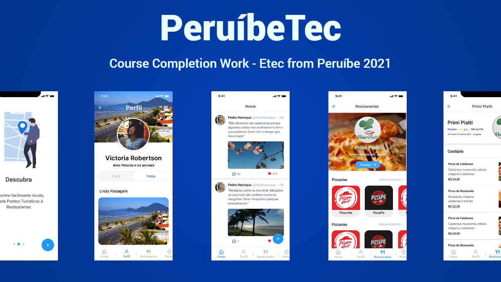

<h1 align="center">
  
</h1>

<h3 align="center">
  📱 PeruibeTec Mobile 📱
</h3>

<p align="center">The best way to connect with Peruíbe !</p>

<p align="center">
  

  <a href="https://www.linkedin.com/in/henrique-martins-5b2bb71a5/" target="_blank" rel="noopener noreferrer">
    
  </a>

  

  <a href="https://github.com/PeruibeTEC/Mobile/commits/main">
    
  </a>

  <a href="https://github.com/PeruibeTEC/Mobile/issues">
    
  </a>

  
</p>

## 📋 Table of Contents

- [Overview](#overview)
- [Technologies](#technologies)
- [Getting started](#getting-started)
  - [Requirements](#requirements)
  - [Installing and configuring the project](#Installing-and-configuring-the-project)
- [How to contribute](#how-to-contribute)
- [License](#license)

## 👀 About

PeruibeTec is an application for the city of Peruíbe in the state of São Paulo, Brazil. It aims to make the city more technological and integrated, in PeruibeTec you really connect with Peruíbe, whether you are a resident or a tourist

Tourists enjoy a usability specifically prepared for tourists

While the residents stay on top of everything that is happening in Peruíbe

<div align="center">
   
</div>

## 🚀 Technologies

The main technologies used in this API are:

- [React](https://pt-br.reactjs.org/)
- [React-Native](https://reactnative.dev/)
- [Expo](https://expo.io/)
- [Node.js](https://nodejs.org/en/)
- [TypeScript](https://www.typescriptlang.org/)
- [Axios](https://github.com/axios/axios)
- [JWT-token](https://jwt.io/)
- [uuid-v4](https://github.com/thenativeweb/uuidv4/)
- [PostgreSQL](https://www.postgresql.org/)
- [Date-fns](https://date-fns.org/)
- [ESlint](https://eslint.org/)
- [Prettier](https://prettier.io/)
- [EditorConfig](https://editorconfig.org/)

## 💻 Getting started

### Requirements

- [Node.js](https://nodejs.org/en/)
- [Expo](https://expo.io/)  
- [Yarn](https://classic.yarnpkg.com/) or [NPM](https://www.npmjs.com/)


### Installing and running the project

*Clone the project and access the folder*

```bash
$ git clone https://github.com/hmartiins/plantmanager 
$ cd plantmanager
```

*Follow the steps below*

```bash
# Install the dependencies
$ yarn install

# Make a copy of '.env.example' to '.env'
# and set with YOUR environment variables.
$ cp .env.example .env

# Finally, run the api service in a development environment :)
$ yarn start

# Well done, PlantManager is started!
```
<br>

## 🤔 How to contribute

Thank you for being interested in making this package better. We encourage everyone to help improve this project with new features, bug fixes or performance improvements. Take some time to read our contribution guide to make this process faster and easier.

### Contribution Guidelines

To understand how to submit an issue, commit and create pull requests, check our [Contribution Guidelines](https://github.com/PeruibeTEC/Mobile/blob/main/.github/CONTRIBUTING.md).

## 📝 License

This project is licensed under the GPL 3.0 License - see the [LICENSE](LICENSE) file for details.
